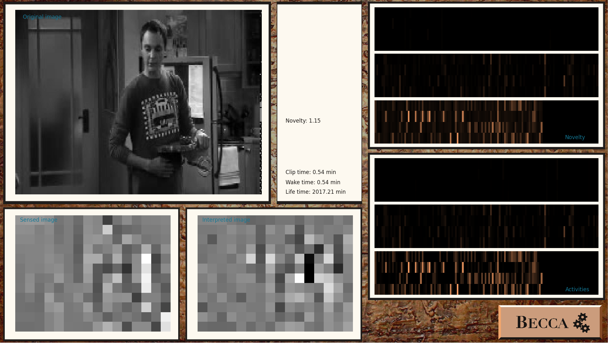

becca_world_watch
=================

The **watch** world identifies anomalies or unexpected occurences in video data. It does this by building the data into a hierarchy of features and learning patterns of feature activity. 



To run BECCA with the watch world, clone this repository into your local copy of the `becca` repository so that it sits in the same directory as the `core` and `worlds` directories.

In `tester.py`, add the line:
```
from becca_world_watch.watch import World
```
and comment out all other World import lines. The watch world also makes use of the OpenCV libraries through their python bindings, it imports `cv2`.

Typing `python tester.py` at the command line will run the listen world. It draws training data from all `.flv` and `.mp4` files that it finds in the `becca_world_watch/data` directory. 

In `watch.py`, manually set the flag variable `self.TEST` to `True` when you want to test the anomaly detection performance. It will look for the test data in `becca_world_watch/test/test_long.avi` and for ground truth information in the same directory under `truth_long.txt`. 

The ground truth text file format is two ASCII numbers per line (e.g. 12.3 14.7) indicating the start and stop times of an anomaly in seconds. There is one line per anomaly.
